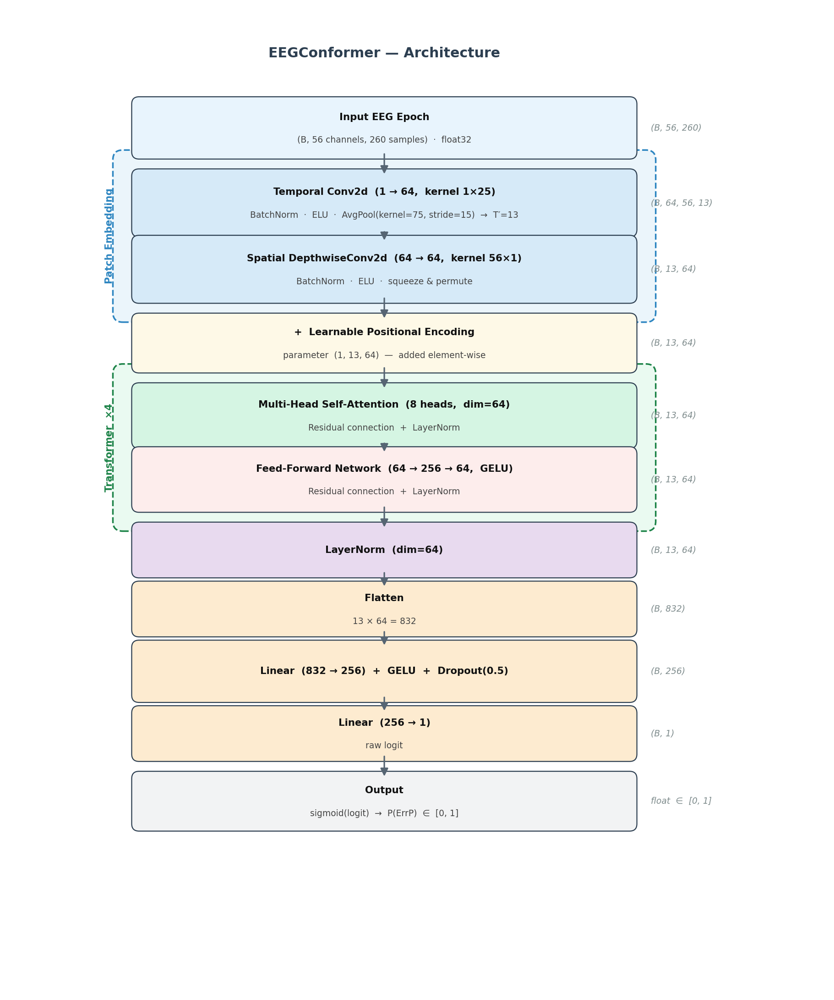
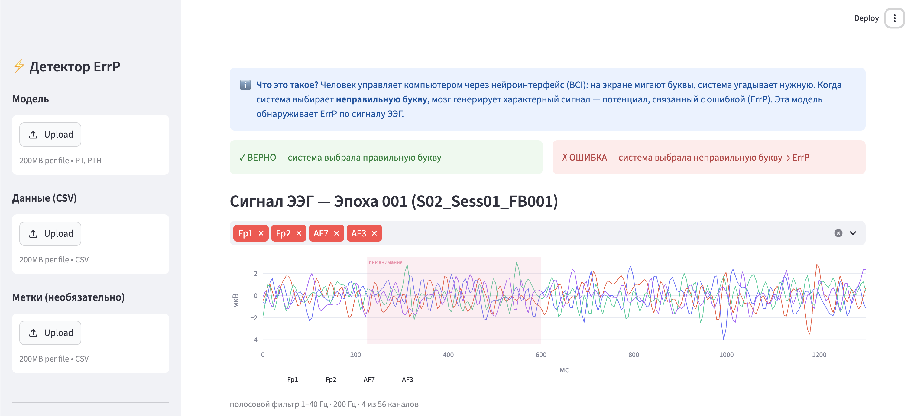
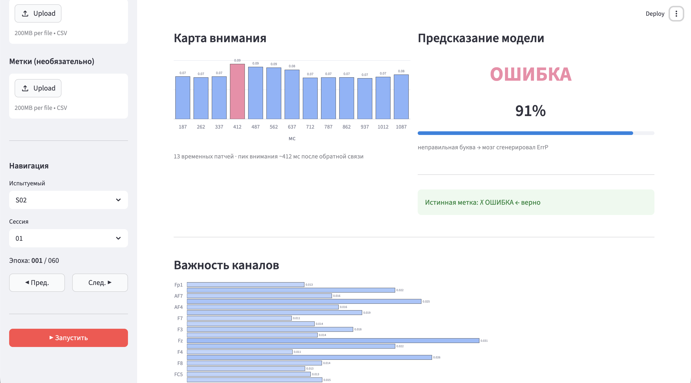

# BCI Challenge @ NER 2015 — EEGConformer

Детектор потенциалов, связанных с ошибкой (ErrP), на основе трансформера.  
Превосходит победителя соревнования по AUC на кросс-валидации.

---

## Соревнование

[BCI Challenge @ NER 2015](https://www.kaggle.com/competitions/inria-bci-challenge/rules) — задача бинарной классификации ЭЭГ-эпох в нейроинтерфейсах.

Испытуемый управляет P300-спеллером (компьютер, угадывающий нужную букву по вспышкам на экране). Каждый раз, когда система выбирает **неправильную** букву, мозг генерирует характерный сигнал — **потенциал, связанный с ошибкой (ErrP)**. Задача — автоматически обнаруживать этот сигнал.

- **Особенность:** обучение и тест на **разных испытуемых** (высокая межсубъектная вариабельность ЭЭГ)
- **Входные данные:** 56 каналов ЭЭГ × 260 отсчётов (200 Гц, 1.3 с после обратной связи)
- **Метка:** 1 = ошибка (ErrP присутствует), 0 = верно
- **Метрика:** AUC

---

## Результаты

| Подход | CV AUC | Примечание |
|---|---:|---|
| Победитель (Риманова геометрия) | 0.7294 | ElasticNet + XDawn + 500 моделей |
| **EEGConformer (наш)** | **0.7402** | ансамбль 12 чекпоинтов, +0.0108 |
| Победитель (private LB) | 0.8458 | использует утечку из сессии 5 |

Ансамбль из 12 чекпоинтов (4-fold × 3 повтора) превосходит базовый метод на том же протоколе без утечки.

---

## Архитектура модели

EEGConformer: CNN-кодировщик патчей + энкодер Трансформера, обученный с предобработкой Евклидовым выравниванием (EA).



**Евклидово выравнивание** отбеливает данные каждого испытуемого по средней ковариации, устраняя основной источник межсубъектной дисперсии до подачи в модель:

```
X_aligned = R^(-1/2) @ X     где R = средняя ковариация по всем эпохам испытуемого
```

**Ключевые отличия от оригинальной статьи EEGConformer:**

| Параметр | Статья | Наша модель |
|---|---|---|
| `emb_size` | 40 | 64 |
| `num_layers` | 6 | 4 |
| Позиционное кодирование | отсутствует | обучаемое (1, 13, 64) |
| Аугментация | нет | шум + сдвиг по времени + масштаб + выключение каналов |

Всего параметров: **419 969** (все обучаемые).

Подробный расчёт по слоям — [`docs/architecture.md`](docs/architecture.md).

---

## Демо (Streamlit)

Интерактивное приложение: загрузка чекпоинта и CSV-данных сессии, навигация по эпохам, визуализация предсказания модели с картой внимания и картой важности каналов.



*ЭЭГ-сигнал эпохи с выделенным временным окном пика внимания модели*



*Карта внимания по 13 временным патчам, предсказание модели (91% уверенность в ОШИБКЕ) и важность электродов по градиентной значимости*

### Запуск

```bash
cd streamlit_demo
uv run streamlit run app.py
```

По умолчанию загружаются данные испытуемого S02, сессия 01, и лучший одиночный чекпоинт (`fold_rep1_fold1.pt`, val AUC 0.776).

### Что показывает демо

| Панель | Описание |
|---|---|
| **Сигнал ЭЭГ** | Сырой сигнал по выбранным каналам; окно пика внимания выделено розовым |
| **Карта внимания** | Среднее внимание по 13 временным патчам (все 4 слоя, 8 голов) |
| **Важность каналов** | Градиентная значимость — `\|∂ logit / ∂ вход\|` усреднённая по времени, по каждому электроду |
| **Предсказание** | ОШИБКА / ВЕРНО с уверенностью в %, значок истинной метки при наличии разметки |

4 наиболее важных канала автоматически выбираются для отображения при переходе к каждой эпохе.

---

## Структура репозитория

```
eegconformer/           Код обучения EEGConformer
  model.py              PatchEmbedding + TransformerBlock + EEGConformer
  dataset.py            Евклидово выравнивание + EEGDataset
  train.py              4-fold CV по испытуемым
  evaluate.py           Оценка AUC ансамбля
  preproc.py            Сырые CSV -> .npy
  tests/                Юнит-тесты

streamlit_demo/         Интерактивное демо
  app.py                Streamlit UI
  inference.py          load_model, run_inference, run_saliency
  processing.py         epoch_csv_files, apply_ea_to_sessions, build_label_dict
  data/                 Чекпоинт + данные S02 Sess01 + метки

docs/
  architecture.md       Подробный расчёт параметров по слоям
  figures/              Диаграммы и скриншоты
  make_diagram.py       Генерация architecture.png
```

### Обучение

```bash
cd eegconformer

# 4-fold CV, 3 повтора (12 чекпоинтов)
uv run python train.py --device cuda --folds 4 --repeats 3 \
    --batch_size 64 --seed_offset 0 --ckpt_dir checkpoints

# Оценка AUC ансамбля
uv run python evaluate.py --device cuda --ckpt_dirs checkpoints
```

---

## Оригинальное решение-победитель

Оригинальный код победителей соревнования (Alexandre Barachant, Rafal Cycon, Cédric Gouy-Pailler) сохранён в корне репозитория (`classif.py`, `cross_valid.py`, `riemann/`).

Использует: XDawn-фильтрацию → ковариационные матрицы → проекцию в касательное пространство → ElasticNet, 500 бэггированных моделей, утечку времени из сессии 5.

---

**Соревнование:** [BCI Challenge @ NER 2015](https://www.kaggle.com/competitions/inria-bci-challenge/rules)  
**Лицензия:** GPLv3 (см. Licence.txt)
